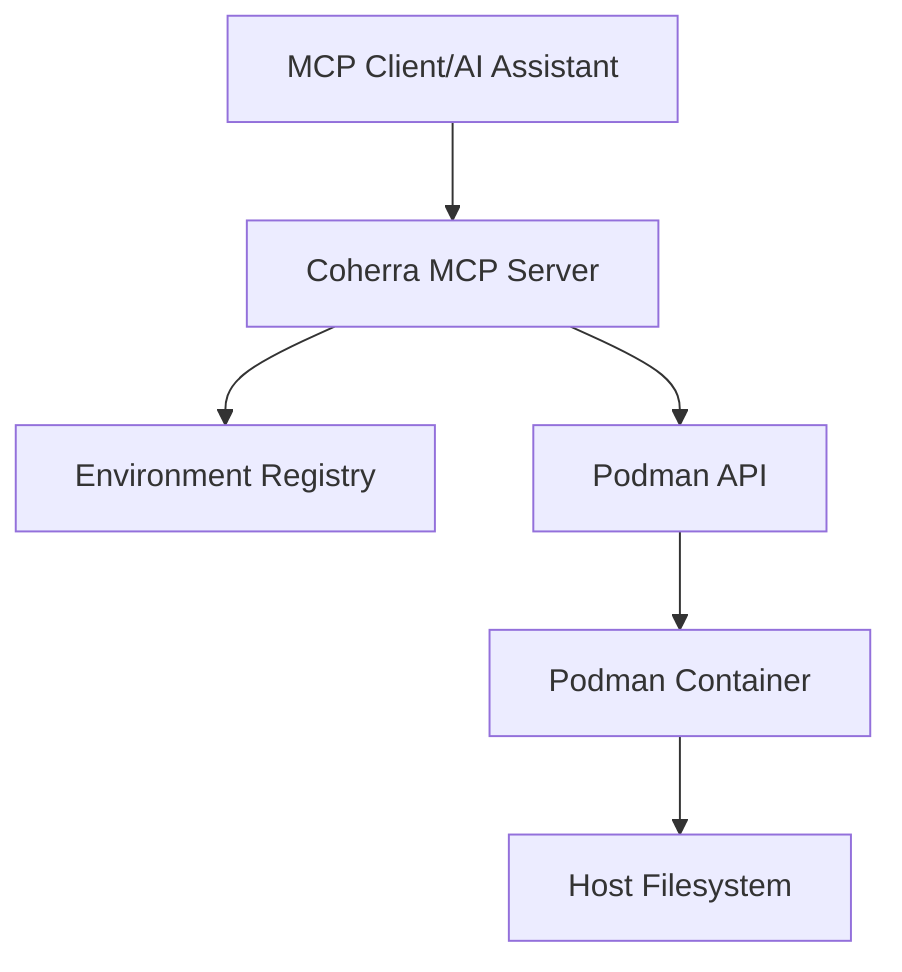
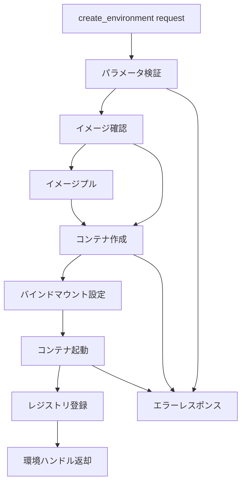
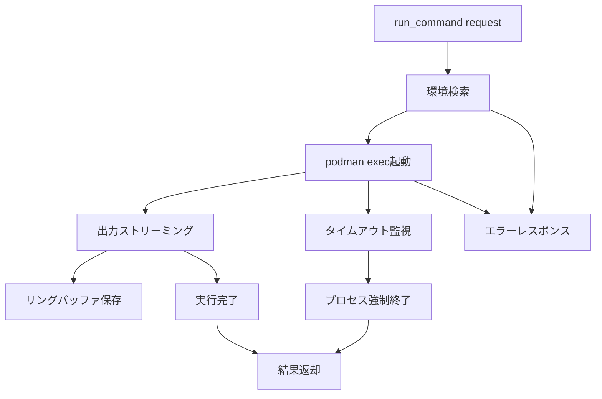

# Technical Design Document

## 概要

**目的**: Coherra MVPは、開発者がAI支援開発環境でコンテナベースの実行環境を効率的に管理できるMCPサーバーを提供します。

**ユーザー**: AIアシスタント（Claude等）およびMCPクライアントが、このサーバーを通じてPodmanコンテナの作成・コマンド実行を行います。

**影響**: 従来のcontainer-use実装をRustベースの高性能実装に置き換え、バインドマウントによるゼロコピー戦略で大幅な性能改善を実現します。

### 目標
- MCPプロトコル準拠のサーバー実装
- `create_environment`と`run_command`の2操作の完全実装
- Podmanバックエンドによる安全なコンテナ管理
- 将来拡張可能なアーキテクチャ基盤

### 非目標
- watch-commit、note-append機能の実装（将来フェーズ）
- Git操作の自動化（MVPでは除外）
- ポート転送・サービス公開機能
- 複雑なオーケストレーション機能

## アーキテクチャ

### ハイレベルアーキテクチャ



**アーキテクチャ統合**:
- 既存パターン保持: MCPのstdio通信、非同期処理パターン
- 新コンポーネントの根拠: 環境レジストリ（複数環境管理）、Podmanクライアント（コンテナ制御）
- 技術スタック整合: rmcp v0.7.0、tokio、bollardの採用
- ステアリング準拠: ゼロコピー原則、イベント駆動設計

### 技術スタックと設計決定

**技術スタック**:
- **MCPサーバー**: rmcp v0.7.0 - 公式Rust SDK、stdio transport対応
- **コンテナ制御**: bollard v0.17 - Podman/Docker API互換クライアント
- **非同期ランタイム**: tokio v1.41 - フル機能セット
- **エラーハンドリング**: anyhow v1.0 - シンプルなエラー伝播

**主要な設計決定**:

**決定1: バインドマウント戦略の採用**
- **コンテキスト**: ファイルI/O性能要件（120ms以下のコミット）
- **代替案**: Export/Import方式、Volume方式、Overlay方式
- **選択アプローチ**: ホストディレクトリを`/workdir`に直接バインドマウント
- **根拠**: ゼロコピーによるI/O削減、即座の変更反映
- **トレードオフ**: セキュリティ考慮が必要 vs 大幅な性能向上

**決定2: 環境レジストリのRwLock管理**
- **コンテキスト**: 複数環境の並行管理要件
- **代替案**: Mutex、Arc<Mutex>、DashMap
- **選択アプローチ**: tokio::sync::RwLock<HashMap<String, EnvironmentHandle>>
- **根拠**: 読み取り多数のアクセスパターンに最適
- **トレードオフ**: 実装の複雑性 vs 並行性能の向上

**決定3: リングバッファによるログ管理**
- **コンテキスト**: メモリ制限下での長時間実行コマンド対応
- **代替案**: 全量バッファリング、ファイル書き込み、ストリーミング
- **選択アプローチ**: 64KB制限のリングバッファ（末尾保持）
- **根拠**: メモリ使用量の予測可能性、最新情報の優先
- **トレードオフ**: 古いログの喪失 vs メモリ効率

## システムフロー

### 環境作成フロー



### コマンド実行フロー



## コンポーネントとインターフェース

### MCPサーバー層

#### McpServer

**責任と境界**
- **主要責任**: MCPプロトコルメッセージのルーティングとレスポンス生成
- **ドメイン境界**: MCPプロトコル層
- **データ所有**: リクエスト/レスポンスメッセージ
- **トランザクション境界**: 単一リクエスト/レスポンス

**依存関係**
- **インバウンド**: MCPクライアント（stdio経由）
- **アウトバウンド**: EnvironmentManager、CommandExecutor
- **外部**: rmcp SDK

**サービスインターフェース**
```typescript
interface McpServer {
  handle_create_environment(params: CreateEnvironmentParams): Result<EnvironmentHandle, McpError>;
  handle_run_command(params: RunCommandParams): Result<CommandResult, McpError>;
  handle_unimplemented(method: string): Result<void, McpError>;
}
```

### 環境管理層

#### EnvironmentRegistry

**責任と境界**
- **主要責任**: アクティブな環境のライフサイクル管理
- **ドメイン境界**: 環境管理サブドメイン
- **データ所有**: 環境ID→EnvironmentHandleマッピング
- **トランザクション境界**: 環境の作成/削除

**依存関係**
- **インバウンド**: McpServer
- **アウトバウンド**: PodmanClient
- **外部**: tokio（RwLock）

**サービスインターフェース**
```typescript
interface EnvironmentRegistry {
  create_environment(env_id: string, config: EnvironmentConfig): Result<EnvironmentHandle, RegistryError>;
  get_environment(env_id: string): Result<EnvironmentHandle, RegistryError>;
  remove_environment(env_id: string): Result<void, RegistryError>;
  list_environments(): Vec<string>;
  cleanup_all(): Result<void, RegistryError>;
}
```

#### PodmanClient

**責任と境界**
- **主要責任**: Podman APIとの通信とコンテナ操作
- **ドメイン境界**: コンテナランタイム層
- **データ所有**: コンテナ設定、実行状態
- **トランザクション境界**: 個別のPodman API呼び出し

**依存関係**
- **インバウンド**: EnvironmentRegistry、CommandExecutor
- **アウトバウンド**: なし
- **外部**: bollard、Podman daemon

**サービスインターフェース**
```typescript
interface PodmanClient {
  pull_image(image: string): Result<void, PodmanError>;
  create_container(config: ContainerConfig): Result<ContainerId, PodmanError>;
  start_container(id: ContainerId): Result<void, PodmanError>;
  exec_command(id: ContainerId, cmd: Vec<string>, env: HashMap<string, string>): Result<ExecStream, PodmanError>;
  stop_container(id: ContainerId): Result<void, PodmanError>;
  remove_container(id: ContainerId): Result<void, PodmanError>;
}
```

### コマンド実行層

#### CommandExecutor

**責任と境界**
- **主要責任**: コンテナ内でのコマンド実行と出力管理
- **ドメイン境界**: コマンド実行サブドメイン
- **データ所有**: 実行ストリーム、出力バッファ
- **トランザクション境界**: 単一コマンドの実行

**依存関係**
- **インバウンド**: McpServer
- **アウトバウンド**: PodmanClient、RingBuffer
- **外部**: tokio（timeout、spawn）

**サービスインターフェース**
```typescript
interface CommandExecutor {
  execute(env_handle: EnvironmentHandle, cmd: Vec<string>, timeout_ms: Option<u64>): Result<CommandResult, ExecutionError>;
  stream_output(stream: ExecStream, buffer: RingBuffer): Result<(String, String), StreamError>;
}
```

#### RingBuffer

**責任と境界**
- **主要責任**: 出力ストリームの効率的なメモリ管理
- **ドメイン境界**: ユーティリティ層
- **データ所有**: 循環バッファデータ
- **トランザクション境界**: なし（純粋なデータ構造）

**サービスインターフェース**
```typescript
interface RingBuffer {
  write(data: &[u8]): void;
  read_tail(max_bytes: usize): Vec<u8>;
  clear(): void;
  capacity(): usize;
}
```

## データモデル

### ドメインモデル

**環境管理エンティティ**:
- **EnvironmentHandle**: 環境の一意識別子とメタデータ
  - env_id: String（一意識別子）
  - container_id: String（Podmanコンテナ ID）
  - project_root: PathBuf（ホスト側パス）
  - mount_path: String（コンテナ内パス）
  - created_at: DateTime
  - status: EnvironmentStatus

**コマンド実行値オブジェクト**:
- **CommandResult**: 実行結果の不変表現
  - exit_code: Option<i32>
  - stdout_tail: String
  - stderr_tail: String
  - execution_time_ms: u64
  - timed_out: bool

### APIデータ契約

**create_environment リクエスト**:
```typescript
interface CreateEnvironmentParams {
  project_root: string;  // 必須：プロジェクトルートパス
  env_id: string;        // 必須：環境識別子
  image: string;         // 必須：コンテナイメージ
  env_vars?: Record<string, string>;  // 任意：環境変数
}
```

**run_command リクエスト**:
```typescript
interface RunCommandParams {
  env_id: string;        // 必須：対象環境ID
  cmd: string[];         // 必須：コマンド配列
  timeout_ms?: number;   // 任意：タイムアウト（デフォルト120000）
  env_vars?: Record<string, string>;  // 任意：追加環境変数
}
```

## エラーハンドリング

### エラー戦略
MCPプロトコルエラーコードへのマッピングと適切な復旧メカニズムの実装。

### エラーカテゴリとレスポンス

**ユーザーエラー（4xx相当）**:
- 無効なパラメータ → InvalidParams (-32602): フィールドレベルの検証メッセージ
- 環境未発見 → MethodNotFound (-32601): 環境IDの確認ガイダンス
- 環境ID重複 → InvalidRequest (-32600): 既存環境の削除方法案内

**システムエラー（5xx相当）**:
- Podman接続失敗 → InternalError (-32603): 起動手順とトラブルシューティング
- コンテナ作成失敗 → InternalError (-32603): リソース状態と回復手順
- タイムアウト → InternalError (-32603): タイムアウト値調整の提案

**ビジネスロジックエラー**:
- イメージ未発見 → InvalidParams (-32602): 利用可能なイメージリスト提供
- マウント失敗 → InternalError (-32603): パス検証とパーミッション確認

### モニタリング
- tracingフレームワークによる構造化ログ
- 環境操作の開始/終了イベント記録
- エラー発生時の詳細コンテキスト保存

## テスト戦略

### ユニットテスト
- EnvironmentRegistry: CRUD操作の正常性
- RingBuffer: 循環バッファのオーバーフロー処理
- エラー変換: anyhow→MCPエラーコードマッピング
- タイムアウトロジック: tokio::time::timeout動作

### 統合テスト
- MCPメッセージ処理: JSON-RPCリクエスト/レスポンス
- 環境ライフサイクル: 作成→実行→削除フロー
- エラー伝播: 各層でのエラーハンドリング
- 並行性: 複数環境の同時操作

### E2Eテスト（手動）
- 環境作成: `create_environment`でコンテナ起動確認
- コマンド実行: `echo hello`の成功確認
- タイムアウト: `sleep 300`の強制終了確認
- クリーンアップ: Ctrl+C時の全環境削除

### パフォーマンステスト（将来）
- 環境作成時間: 目標3秒以内
- コマンド実行オーバーヘッド: 目標50ms以下
- メモリ使用量: リングバッファ制限の検証