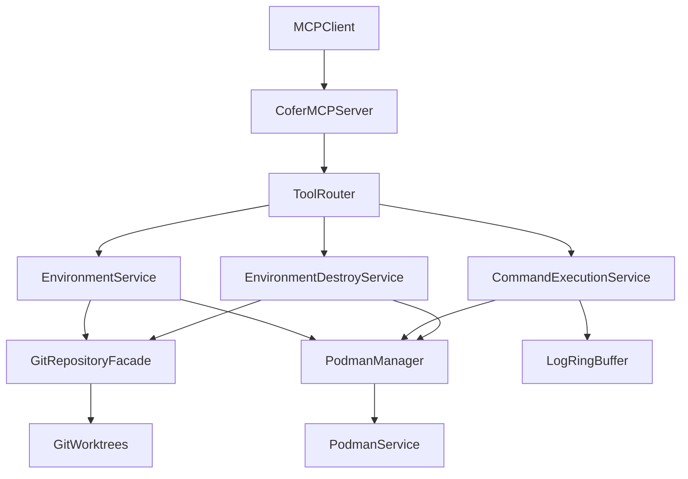
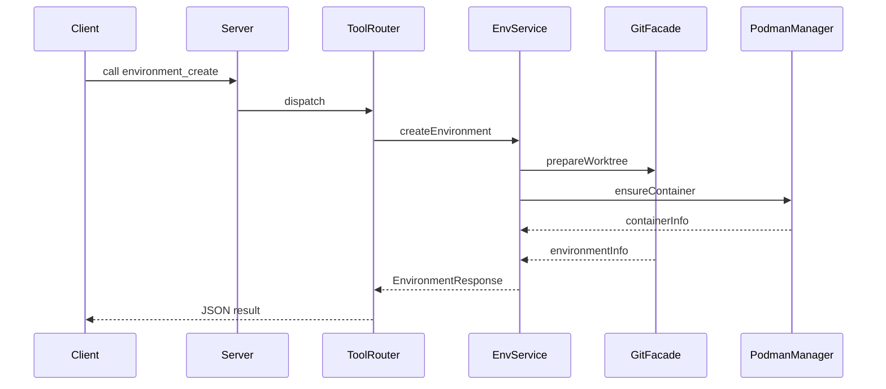
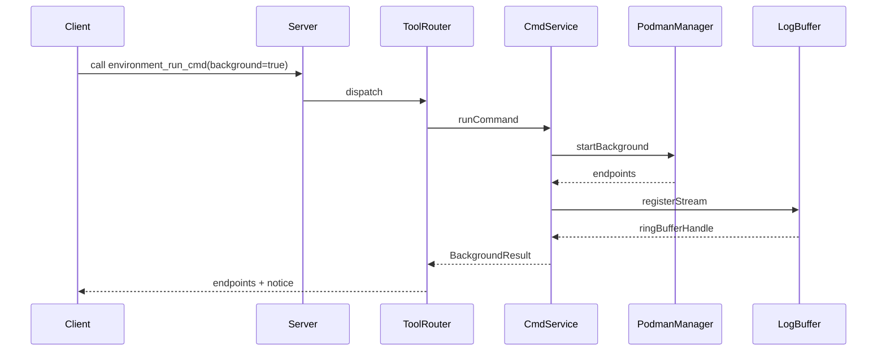

# Technical Design Document

## Overview
Cofer MCP サーバ MVP は、dagger/container-use の MCP ツール群と互換性を保ちながら、Podman とゼロコピー Git ワークツリーを活用して高速かつ安定した環境ライフサイクル管理を提供する。これにより AI コーディングエージェントや CLI クライアントは単一エンドポイント経由で環境の作成・利用・破棄を完結でき、既存の `cofer init` によるリポジトリ初期化と組み合わせて一貫した開発者体験を実現する。
利用者は AI エージェント、オペレーター、およびプラットフォーム開発者であり、各ユーザは環境作成 (`environment_create`)、コマンド実行 (`environment_run_cmd`)、環境破棄 (`environment_destroy`) の 3 ツールをワークフローに組み込み、レスポンス互換性を維持したまま高速な操作が可能となる。
この実装は既存の CLI 主導アーキテクチャに非同期 MCP サーバを追加し、Git 操作・Podman 操作・ログ制限に関するプロダクト要求を満たすための新たなアプリケーション層とインフラ層を導入する。

### Goals
- MCP ツールインターフェースを container-use 互換で提供し、AI クライアントが移行時に追加対応を必要としないこと。
- Podman と bind-mount を用いた環境作成・破棄を 120ms/≤2s の性能要件内で安定動作させること。
- コマンド実行結果のログリングおよびタイムアウト制御を実装し、ハングやメモリ肥大を防止すること。

### Non-Goals
- environment_file_* や add_service など追加ツール群の実装は範囲外とし、将来拡張に委ねる。
- 既存 CLI (`cofer init` など) の挙動変更や Podman 以外のコンテナランタイム対応は本フェーズで行わない。
- AI クライアント側プラグインの実装・デプロイは対象外とし、必要なガイドラインのみ提供する。

## Architecture

### Existing Architecture Analysis
- 現行コードは `src/main.rs` の CLI と `src/git/mod.rs` の Git ユーティリティから成り、Tokio 非同期ランタイム、`clap`、`tracing` を活用している。
- Git ワークツリー生成・リモート設定などの処理は既存関数を再利用可能であり、MCP サーバ実装はこれらをアプリケーションサービス層から呼び出す構成とする。
- Steering に定義されたゼロコピー方針、リングバッファによるログ制限、タイムアウト徹底を維持しつつ、新たに MCP 接続と Podman API 呼び出しを追加する。

### High-Level Architecture


**Architecture Integration**
- 既存パターンの踏襲: Tokio ベースの非同期実行、`tracing` による構造化ログ、`.cofer/` ディレクトリ構造を維持。
- 新規コンポーネント: MCP ツールルーター、環境サービス層、Podman 管理層、ログリングユーティリティを追加し、責務を分離。
- 技術整合性: `rmcp` を用いた MCP 実装、`bollard` による Podman API 呼び出し、`gix`/`git2` の併用を採択し既存依存関係内に収める。
- Steering 遵守: ゼロコピー bind-mount、リングバッファ、タイムアウトガード、Windows Job Object 相当のプロセス終了方針を設計内に取り込む。

## Technology Stack and Design Decisions

### Technology Stack
- **MCP レイヤ**: `rmcp` でツール定義と JSON-RPC ストリーム処理を実装。理由は公式 Rust MCP SDK であり container-use 互換の呼び出し属性を設定しやすい。代替候補だった `mcp-sdk` crate は API が安定せず採用せず。
- **アプリケーション層**: Rust のサービスモジュールを新設し、Tokio タスクで非同期並列処理。`async-trait` でサービスインターフェースを統一。代替の同期実装は Podman I/O ブロッキングを増やすため不採用。
- **コンテナ制御**: `bollard` を Podman REST モードで使用し、背景コマンドのポート公開や Job Object 相当の kill を委譲。CLI 経由の Podman 呼び出しはプロセス生成コストが高く、ログ制御が困難なため避ける。
- **Git 操作**: 差分・コミットを `gix`、ワークツリー操作とリモート管理を `git2` で行うハイブリッド構成を継続。`libgit2` のみでは高速差分が不足し、`gix` 単独ではワークツリー API が不足するため。
- **ロギング/監視**: `tracing` と `tracing-subscriber` でツール呼び出し単位のログ出力を行い、`RingBuffer` 実装は `bytes` で固定長を保持。外部ログ基盤は MVP 範囲外。

### Key Design Decisions
- **Decision**: MCP ツールレスポンスを container-use 互換 JSON で返す。
  - **Context**: 既存クライアントは `remote_ref`, `checkout_command` など特定フィールドを期待する。
  - **Alternatives**: (1) Cofer 独自スキーマ、(2) JSON:API 準拠レスポンス。
  - **Selected Approach**: container-use 互換の snake_case JSON を返し、内部構造のみ Rust struct にマッピング。
  - **Rationale**: クライアント改修不要で移行を早められる。
  - **Trade-offs**: JSON 命名が Rust の慣例と異なるためシリアライザ属性が必要。
- **Decision**: Podman コンテナを環境 ID ごとに再利用し、背景実行時のみ新規コンテナを作成するガードを導入。
  - **Context**: 背景コマンド用コンテナとフォアグラウンド実行を分離する必要がある。
  - **Alternatives**: (1) 呼び出しごとに新規コンテナ、(2) 常に単一コンテナを再利用。
  - **Selected Approach**: 基本コンテナを env_id 単位で再利用し、`background=true` 時は軽量子コンテナを生成。
  - **Rationale**: 再利用で起動コストを削減しつつ背景サービスの独立性を確保。
  - **Trade-offs**: コンテナ状態の同期管理が複雑になり、追加メタデータが必要。
- **Decision**: Git 操作はアプリケーション層で排他ロック管理を行い、Podman 側は非同期ハンドラで実行する。
  - **Context**: 環境作成・破棄中に並列 Git 操作が競合するとワークツリー破損が起こる。
  - **Alternatives**: (1) 各ツール内で都度ロック、(2) Git 側に排他のみ委譲。
  - **Selected Approach**: `EnvironmentRegistry` が操作単位ロックを提供し、GitFacade は軽量に保つ。
  - **Rationale**: 制御点を一箇所に集約し整合性を保証。
  - **Trade-offs**: Registry 実装が複雑化し、デッドロック対策が必要。

## System Flows

### environment_create 呼び出しシーケンス


### environment_run_cmd 背景実行フロー


## Requirements Traceability
| Requirement | Summary | Components | Interfaces | Flows |
|-------------|---------|------------|------------|-------|
| 1.1–1.4 | environment_create ツール入力検証と環境生成 | ToolRouter, EnvironmentService, GitRepositoryFacade, PodmanManager | `EnvironmentService::create_environment`, Podman API | environment_create シーケンス |
| 2.1–2.4 | environment_run_cmd 実行制御とログリング | CommandExecutionService, PodmanManager, LogRingBuffer | `CommandExecutionService::run_command`, `LogRingBuffer::push_line` | environment_run_cmd フロー |
| 3.1–3.4 | environment_destroy による停止とクリーンアップ | EnvironmentDestroyService, PodmanManager, GitRepositoryFacade | `EnvironmentDestroyService::destroy_environment` | 共通クリーンアップ処理（テキスト記述） |
| 4.1–4.4 | MCP 登録・リミット制御・エラーハンドリング・計測 | McpServerBootstrap, EnvironmentRegistry, ToolRouter | `McpServerBootstrap::register_tools`, `EnvironmentRegistry::acquire` | サーバ起動処理（説明内） |

## Components and Interfaces

### Interface Layer

#### McpServerBootstrap
**Responsibility & Boundaries**
- Primary Responsibility: `rmcp` を用いてサーバを起動し、ツール定義を登録する。
- Domain Boundary: MCP 接続管理ドメイン。
- Data Ownership: ツールメタデータ、JSON スキーマ。
- Transaction Boundary: ツール登録時のみ。

**Dependencies**
- Inbound: 実行エントリ (`main.rs`)。
- Outbound: ToolRouter、EnvironmentRegistry。
- External: `rmcp` ランタイム API。

**Contract Definition**
```rust
pub trait McpServerBootstrap {
    async fn start(self: Box<Self>) -> anyhow::Result<()>;
}
```
- Preconditions: Tokio ランタイムが初期化済みであること。
- Postconditions: 各ツールが MCP カタログに登録済みでストリーミング待受状態に入る。
- Invariants: 同一ツール名は一度のみ登録。

#### ToolRouter
**Responsibility & Boundaries**
- Primary Responsibility: ツール名から各サービスの実装にディスパッチする。
- Domain Boundary: MCP ツールディスパッチドメイン。
- Data Ownership: ツール→ハンドラマッピング。

**Dependencies**
- Inbound: McpServerBootstrap。
- Outbound: EnvironmentService, CommandExecutionService, EnvironmentDestroyService。

**Contract Definition**
```rust
pub trait ToolRouter {
    async fn handle_call(&self, request: mcp::CallToolRequest) -> anyhow::Result<mcp::CallToolResult>;
}
```
- Preconditions: リクエストに `environment_source` など必要パラメータが含まれている。
- Postconditions: 実行結果または構造化エラーを返す。
- Invariants: エラーは container-use 互換コードにマッピング。

### Application Layer

#### EnvironmentService
**Responsibility & Boundaries**
- Primary Responsibility: 環境生成、メタデータ発行、コンテナ起動前準備。
- Domain Boundary: 環境ライフサイクル。
- Data Ownership: 環境レジストリ内の状態スナップショット。
- Transaction Boundary: Git と Podman 操作を単一タスク内で整合。

**Dependencies**
- Inbound: ToolRouter。
- Outbound: GitRepositoryFacade, PodmanManager, EnvironmentRegistry。

**Contract Definition**
```rust
pub struct CreateEnvironmentInput {
    pub environment_source: PathBuf,
    pub title: String,
    pub image: String,
    pub from_git_ref: Option<String>,
    pub allow_replace: bool,
}

pub trait EnvironmentService {
    async fn create_environment(
        &self,
        input: CreateEnvir
